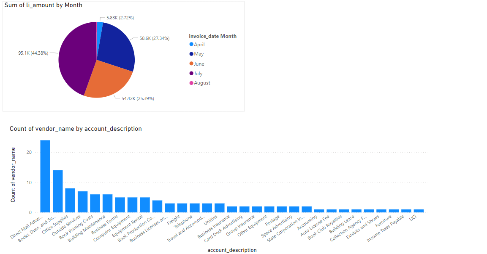

# JOIN_TABLES_SQL_VISUALIZATION
## This piece joins two datasets using INNER JOIN SQL SYNTAX
### Also visualization chart was created using PowerBI
### Dowload the SQL code and run in SQL Server: You can also use MySQL Server
### SQL Server was used and below is the code


``` use ap;
/* Create Table to copy new data into */
CREATE TABLE Vendor_Account_Details (
  vendor_name VARCHAR(255) NOT NULL,
  default_account VARCHAR(255) NOT NULL,
  account_description VARCHAR(255) NOT NULL
);

/* Insert into the new Table*/
INSERT INTO Vendor_Account_Details (vendor_name, default_account, account_description)

SELECT vendors.vendor_name,
vendors.default_account_number AS default_account, 
general_ledger_accounts.account_description AS description
FROM Vendors
INNER JOIN general_ledger_accounts ON vendors.default_account_number = general_ledger_accounts.account_number
ORDER BY  account_description, vendor_name;

SELECT * FROM Vendor_Account_Details; /* Call the data to confirm the data in the new table */


---------------- Code 2 ---------------------

use ap;
/* Create Table to copy new data into */
CREATE TABLE Vendor_Invoices (
  vendor_name VARCHAR(255) NOT NULL,
  invoice_date DATE NOT NULL,
  invoice_number VARCHAR(255) NOT NULL,
  li_sequence INT NOT NULL,
  li_amount DECIMAL(10,2) NOT NULL,
  
);
/* Insert into the new Table*/
INSERT INTO Vendor_Invoices (vendor_name, invoice_date, invoice_number, li_sequence, li_amount)

SELECT vendors.vendor_name, invoices.invoice_date,
invoices.invoice_number, invoice_line_items.invoice_sequence,
invoice_line_items.line_item_amount
FROM Vendors
INNER JOIN invoices ON vendors.vendor_id = invoices.vendor_id
INNER JOIN invoice_line_items ON invoices.invoice_id = invoice_line_items.invoice_id;

SELECT * FROM Vendor_Invoices; /* Call the data to confirm the data in the new table */
```
## The visualization can be seen as below

